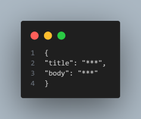

# A Simple Node.js API for Posting and Retrieving Content

## Built for learning and practicing JavaScript development.

I built this api to practice and learn Javascript development. This straightforward Node.js API allows users to post content by sending a POST request to http://localhost:4000/post, with the post data structured in json format as follows:

Both the "title" and "body" should be typed in lower case. To retrieve posted content, a GET request can be made to http://localhost:4000/.

Configuration:

- Inside the ".env" folder, locate the "MONGO_DB_URI" variable.
- Replace the "\*\*\*\*" signs in the variable with your MongoDB Atlas database URI.
